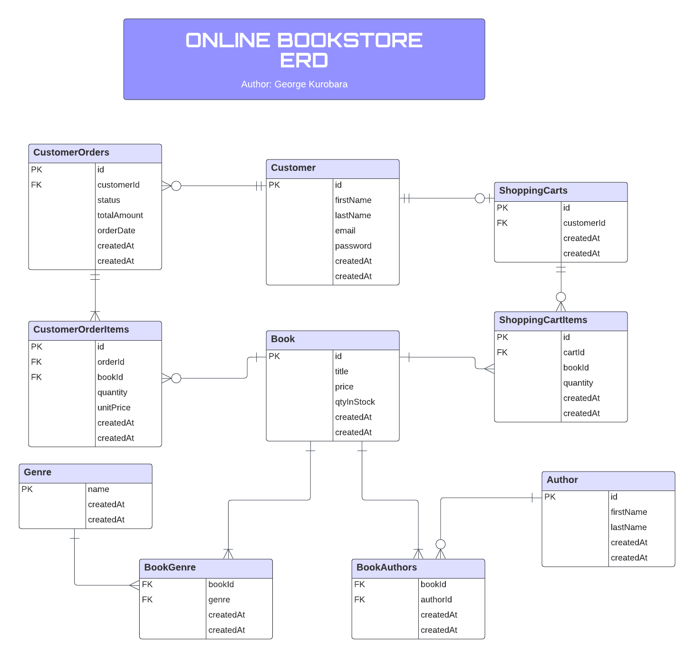

# ONLINE BOOKSTORE



<p align="center">
  ER Diagram
</p>

## Description
A RESTful API for a simple online bookstore.

## Technologies
- Typescript
- NodeJS
- [NestJS](https://nestjs.com/)
- MySQL
- Sequelize ORM
- Redis
- Docker

## Features
- RESTful API built with NestJS
- Session authentication using Redis as session store
- Input validation
- Database transactions
- Database migrations using Sequelize
- Docker
- Typescript support

## API Documentation
Click here for the [API Documentation](https://documenter.getpostman.com/view/5935573/2s9YeLZqFz)

## Getting Started
Before proceeding, make sure you have the following installed:
- [Docker](https://www.docker.com/)

Follow the instructions given below to get this project up and running on your local machine.  

1. Clone this repository by running `git clone git@github.com:georgeben/online-book-store.git`
2. `cd` online-book-store
3. Create a file in the project's root named .env and copy the content of .env.schema and paste it into .env. Fill in the appropriate values for any missing env.
4. Run `docker-compose --env-file .env run api npm run db:init` to initialize the database
5. Run `docker-compose --env-file .env up -d` to start the application
6. Access the application at [localhost:3000](http://localhost:3000)

## Scripts

```bash
# Install dependencies
$ npm install

# Start application
$ npm run start

# Start application in watch mode
$ npm run start:dev

# Initialize database
$ npm run db:init

# Run migrations
$ npm run migrate:up

# Run seeders
$ npm run db:seed
```

## Test

```bash
# unit tests
$ npm run test

# e2e tests
$ npm run test:e2e

# test coverage
$ npm run test:cov
```

## Improvements
- e2e tests
- pagination

